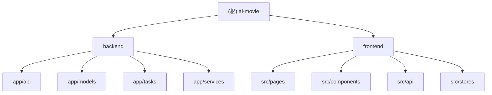

# AI Movie 项目文档

## 变更记录 (Changelog)

- **2026-03-07 20:10:23** - 初始化项目文档，完成架构扫描

## 项目愿景

AI Movie 是一个 AI 驱动的视频制作平台。用户上传照片，通过 AI 生成脚本，系统自动将照片组合成带转场效果的视频。核心价值：降低视频制作门槛，让普通用户也能快速产出专业视频内容。

## 架构总览

**架构模式**: 前后端分离 + 异步任务队列

- **前端**: React 19 SPA，通过 REST API 与后端通信
- **后端**: FastAPI 异步框架，提供 RESTful API
- **数据库**: PostgreSQL (主存储) + Redis (缓存/队列)
- **任务队列**: Celery + Redis，处理视频渲染等耗时任务
- **文件存储**: 本地文件系统 (uploads/)

**数据流**:
```
用户上传照片 → 后端存储 + 生成缩略图
用户触发 AI 生成脚本 → LLM 服务 → 返回场景列表
用户编辑时间线 → 提交视频生成任务 → Celery Worker
Worker 调用 FFmpeg → 合成视频 → 更新任务状态
```

## 模块结构图



## 模块索引

| 模块路径 | 语言 | 职责 | 入口文件 |
|---------|------|------|---------|
| `backend/` | Python | FastAPI 后端服务，提供 REST API、数据持久化、异步任务调度 | `app/main.py` |
| `frontend/` | TypeScript | React 前端应用，用户界面、状态管理、API 调用 | `src/main.tsx` |

## 运行与开发

### 快速启动 (Docker Compose)

```bash
# 启动所有服务
docker-compose up -d

# 访问地址
# 前端: http://localhost:3000
# 后端: http://localhost:8000
# API 文档: http://localhost:8000/docs
```

### 本地开发

**后端**:
```bash
cd backend
python -m venv venv && source venv/bin/activate
pip install -r requirements.txt
alembic upgrade head
uvicorn app.main:app --reload --port 8000
```

**前端**:
```bash
cd frontend
pnpm install
pnpm dev  # 启动在 http://localhost:5173
```

**Celery Worker**:
```bash
cd backend
celery -A app.tasks worker --loglevel=info --concurrency=3
```

### 环境变量

关键配置 (详见 `.env.example`):
- `DATABASE_URL`: PostgreSQL 连接串
- `REDIS_URL`: Redis 连接串
- `SECRET_KEY`: JWT 签名密钥
- `FERNET_KEY`: 敏感数据加密密钥
- `CORS_ORIGINS`: 允许的前端域名

## 测试策略

**当前状态**: 项目未包含自动化测试

**建议补充**:
- 后端: pytest + pytest-asyncio，覆盖 API 端点和业务逻辑
- 前端: Vitest + React Testing Library，覆盖关键组件和交互
- E2E: Playwright，覆盖核心用户流程

## 编码规范

### TypeScript (前端)
- **严格模式**: 禁止 `any` 类型
- **类型定义**: 统一放在 `type.ts` 文件
- **文件长度**: 单文件不超过 500 行，超过则拆分
- **包管理**: 使用 pnpm
- **图标**: 使用 lucide-react，不用 emoji

### Python (后端)
- **类型注解**: 使用 Python 3.11+ 类型提示
- **异步优先**: 数据库操作使用 async/await
- **依赖注入**: 通过 FastAPI Depends 管理依赖
- **错误处理**: 使用 HTTPException 返回标准错误

### 通用
- **命名**: 清晰表意，避免缩写
- **注释**: 只在复杂逻辑处添加，代码应自解释
- **提交**: 小步提交，每次提交只做一件事

## AI 使用指引

### 数据结构优先
在修改功能前，先理解核心数据模型：
- `User` → `Project` → `Photo` / `Script` → `VideoTask`
- `Script.content` 是 JSONB，存储场景数组
- `VideoTask` 通过 Celery 异步处理

### 关键路径
1. **照片上传**: `POST /api/v1/projects/{id}/photos` → 存储原图 + 生成缩略图
2. **脚本生成**: `POST /api/v1/scripts/generate` → 调用 LLM → 返回场景列表
3. **视频生成**: `POST /api/v1/video-tasks` → 创建任务 → Celery Worker → FFmpeg 合成

### 常见陷阱
- **异步数据库**: 后端必须用 `async def` + `await`
- **CORS**: 前端开发时通过 Vite proxy，生产环境需配置 `CORS_ORIGINS`
- **文件路径**: 上传文件存储在 `uploads/`，数据库只存相对路径
- **任务状态**: VideoTask 状态由 Celery Worker 更新，前端需轮询

### 扩展建议
- **缓存**: 对频繁查询的数据（如模板脚本）添加 Redis 缓存
- **CDN**: 生产环境将 `uploads/` 迁移到对象存储 + CDN
- **监控**: 添加 Sentry 错误追踪和 Prometheus 指标
- **权限**: 当前只有用户级权限，可扩展为团队/组织级

## 技术债务

1. **缺少测试**: 无单元测试和集成测试
2. **错误处理**: 部分 API 错误信息不够详细
3. **日志**: 缺少结构化日志和链路追踪
4. **配置管理**: 敏感配置硬编码在代码中（如默认密钥）
5. **文件存储**: 本地存储不适合生产环境，需迁移到对象存储
