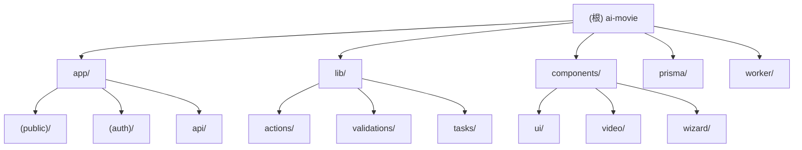

# AI Movie 项目文档

## 变更记录 (Changelog)

- **2026-03-10 19:43:04** - 架构重大变更：从前后端分离迁移到 Next.js 15 全栈架构，更新完整文档
- **2025-03-29 14:23:45** - 完整架构扫描，更新模块索引与覆盖率报告
- **2026-03-08 18:01:49** - 更新架构扫描，新增 BGM 功能模块，补充测试文件统计
- **2026-03-07 20:10:23** - 初始化项目文档，完成架构扫描

## 项目愿景

AI Movie 是一个 AI 驱动的视频制作平台。用户上传照片，通过 AI 生成脚本，系统自动将照片组合成带转场效果的视频。核心价值：降低视频制作门槛，让普通用户也能快速产出专业视频内容。

## 架构总览

**架构模式**: Next.js 15 全栈应用 (App Router) + BullMQ 任务队列

- **前端**: React 19 + Next.js 15 App Router，服务端渲染 + 客户端交互
- **后端**: Next.js API Routes (App Router)，提供 RESTful API
- **认证**: NextAuth.js v5 (beta)，支持 Credentials Provider
- **数据库**: PostgreSQL + Prisma ORM
- **任务队列**: BullMQ + Redis，处理视频渲染等耗时任务
- **文件存储**: S3 兼容对象存储 (MinIO/AWS S3)

**数据流**:
```
用户上传照片 → API Route 存储到 S3 → 数据库记录
用户触发 AI 生成脚本 → Server Action → LLM 服务 → 返回场景列表
用户编辑时间线 + 选择角色 → 提交视频生成任务 → BullMQ Worker
Worker 调用视频生成 API → 合成视频 → 更新任务状态 → S3 存储
```

## 模块结构图



## 模块索引

| 模块路径 | 语言 | 职责 | 入口文件 |
|---------|------|------|---------|
| `app/` | TypeScript | Next.js App Router 页面和 API 路由 | `app/layout.tsx` |
| `lib/` | TypeScript | 业务逻辑、Server Actions、工具函数 | `lib/auth.ts`, `lib/prisma.ts` |
| `components/` | TypeScript | React 组件库（UI、业务组件） | `components/ui/*`, `components/wizard/*` |
| `prisma/` | Prisma Schema | 数据库模型定义 | `prisma/schema.prisma` |
| `worker/` | Python | BullMQ Worker，处理异步任务 | `worker/main.py` |
| `tests/` | TypeScript | 单元测试和 E2E 测试 | `tests/setup.ts` |

## 运行与开发

### 快速启动 (Docker Compose)

```bash
# 启动所有服务（PostgreSQL + Redis + MinIO + Worker）
docker-compose up -d

# 初始化数据库
pnpm prisma migrate deploy

# 启动 Next.js 开发服务器
pnpm dev

# 访问地址
# 前端: http://localhost:3000
# MinIO Console: http://localhost:9001
```

### 本地开发

**前置要求**:
- Node.js 18+
- pnpm
- Docker (用于 PostgreSQL + Redis + MinIO)

**步骤**:
```bash
# 1. 安装依赖
pnpm install

# 2. 启动基础设施
docker-compose up -d postgres redis minio

# 3. 配置环境变量
cp .env.example .env
# 编辑 .env，设置 DATABASE_URL、REDIS_URL 等

# 4. 初始化数据库
pnpm prisma generate
pnpm prisma migrate dev

# 5. 启动开发服务器
pnpm dev

# 6. 启动 Worker（另一个终端）
docker-compose up worker
```

### 环境变量

关键配置 (详见 `.env.example`):
- `DATABASE_URL`: PostgreSQL 连接串（支持 schema 参数）
- `REDIS_URL`: Redis 连接串
- `NEXTAUTH_SECRET`: NextAuth.js 签名密钥
- `NEXTAUTH_URL`: 应用 URL（生产环境必填）
- `OPENAI_API_KEY`: OpenAI API 密钥（用于脚本生成）
- `VIDEO_PROVIDER`: 视频生成提供商（mock/runway/...）
- `S3_ENDPOINT`, `S3_BUCKET`, `S3_ACCESS_KEY`, `S3_SECRET_KEY`: S3 配置

## 测试策略

**当前状态**:
- 单元测试: 3 个测试文件（auth、project、character 验证）
- E2E 测试: 1 个测试文件（creation-flow.spec.ts）
- 测试框架: Vitest (单元) + Playwright (E2E)
- 覆盖率: 低（仅覆盖验证层）

**测试命令**:
```bash
# 单元测试
pnpm test              # 运行一次
pnpm test:watch        # 监听模式

# E2E 测试
pnpm test:e2e          # 运行 E2E
pnpm test:e2e:ui       # UI 模式
```

**建议补充**:
- Server Actions 测试（lib/actions/*）
- API Routes 测试（app/api/*）
- 组件测试（components/*）
- Worker 任务测试（worker/*）
- 集成测试（数据库操作）

## 编码规范

### TypeScript
- **严格模式**: 禁止 `any` 类型
- **类型定义**: 统一放在 `type.ts` 或 `types.ts` 文件
- **文件长度**: 单文件不超过 500 行，超过则拆分
- **包管理**: 使用 pnpm
- **图标**: 使用 lucide-react，不用 emoji

### Next.js 约定
- **Server Actions**: 放在 `lib/actions/` 目录，使用 `"use server"` 指令
- **Client Components**: 使用 `"use client"` 指令
- **API Routes**: 放在 `app/api/` 目录，使用 Route Handlers
- **布局**: 使用 `(public)` 和 `(auth)` 路由组区分公开和认证页面

### 数据库
- **ORM**: Prisma，类型安全
- **迁移**: 使用 `prisma migrate dev` 创建迁移
- **Schema**: 支持自定义 schema（通过 DATABASE_URL 参数）

## AI 使用指引

### 数据结构优先
核心数据模型（Prisma Schema）：
- `User` → `Project` → `Character` / `Script` / `Scene` / `Video` / `Storyboard`
- `Script.content` 是 JSON，存储场景数组
- `Video` 和 `VideoClip` 通过 BullMQ 异步处理
- `ProjectCharacter` 是多对多关系表

### 关键路径

1. **用户注册/登录**:
   - `app/(public)/register/page.tsx` → `app/api/register/route.ts`
   - `app/(public)/login/page.tsx` → NextAuth.js → `lib/auth.ts`

2. **创建项目**:
   - `app/(auth)/create/page.tsx` → `lib/actions/project.ts` → Prisma

3. **快速创建流程**:
   - `app/(auth)/create/quick/page.tsx` → `app/api/projects/quick-create/route.ts`
   - → `lib/tasks/quick-create-pipeline.ts` → BullMQ → Worker

4. **视频生成**:
   - `lib/actions/generate-video.ts` → `lib/queue.ts` → BullMQ
   - → Worker 处理 → 更新 `Video.status` → S3 存储

5. **进度查询**:
   - `app/api/projects/[projectId]/progress/route.ts` → 轮询任务状态

### 常见陷阱

- **Server vs Client**: Server Actions 不能直接调用客户端状态，需通过 API 或 revalidate
- **Prisma Adapter**: 使用 `@prisma/adapter-pg` 支持自定义 schema
- **NextAuth Session**: 使用 JWT 策略，session 存储在 token 中
- **BullMQ 连接**: Worker 和 Next.js 共享 Redis，需配置 `lazyConnect: true`
- **S3 存储**: 本地开发用 MinIO，生产环境用 AWS S3
- **环境变量**: Next.js 只暴露 `NEXT_PUBLIC_*` 到客户端

### 扩展建议

- **缓存**: 使用 Next.js `unstable_cache` 或 Redis 缓存频繁查询
- **实时更新**: 考虑 Server-Sent Events 或 WebSocket 替代轮询
- **监控**: 添加 Sentry 错误追踪和 BullMQ Dashboard
- **权限**: 当前只有用户级权限，可扩展为团队/组织级
- **配额管理**: 已有基础配额系统（`User.videosRemaining`），可扩展订阅计划

## 技术债务

1. **测试覆盖率不足**: 仅有 4 个测试文件，需补充完整测试套件
2. **错误处理**: 部分 Server Actions 错误信息不够详细
3. **日志**: 缺少结构化日志和链路追踪
4. **配置管理**: `.env.example` 中有默认密钥（生产环境需替换）
5. **Worker 实现**: Worker 代码在 `worker/` 目录，但未在本次扫描中详细分析
6. **类型安全**: 部分 JSON 字段（如 `Script.content`）缺少 Zod 验证

## 覆盖率报告

**扫描时间**: 2026-03-10 19:43:04

### 应用层（app/）
- 总文件数: 22 个 TypeScript/TSX 文件
- 页面路由: 12 个（public: 4, auth: 8）
- API 路由: 5 个
- 布局文件: 3 个
- 覆盖状态: 完整扫描

### 业务逻辑层（lib/）
- 总文件数: 39 个 TypeScript 文件
- Server Actions: 19 个
- 验证层: 6 个
- 工具函数: 14 个
- 覆盖状态: 完整扫描

### 组件层（components/）
- 总文件数: 68 个 TypeScript/TSX 文件
- UI 组件: 15 个
- 业务组件: 53 个
- 覆盖状态: 完整扫描

### 测试层（tests/）
- 单元测试: 3 个（auth、project、character 验证）
- E2E 测试: 1 个（creation-flow）
- 覆盖状态: 测试覆盖率低

### 数据库层（prisma/）
- Schema 文件: 1 个
- 模型数量: 11 个（User、Project、Character、Script、Scene、Video、Storyboard、VideoClip、Account、Session、ProjectCharacter）
- 覆盖状态: 完整定义

### 主要缺口
- Server Actions 测试（lib/actions/*）
- API Routes 测试（app/api/*）
- 组件测试（components/*）
- Worker 任务测试（worker/*）
- 集成测试（数据库操作）
- E2E 测试覆盖不足（仅有基础流程）

## 下一步建议

1. 补充 Server Actions 单元测试（使用 Vitest + Prisma Mock）
2. 补充 API Routes 测试（使用 Next.js Test Helpers）
3. 补充组件测试（使用 Vitest + React Testing Library）
4. 扩展 E2E 测试覆盖完整用户流程（注册 → 创建项目 → 上传照片 → 生成脚本 → 生成视频）
5. 添加 Worker 任务测试（模拟 BullMQ 任务）
6. 添加结构化日志（pino）和错误追踪（Sentry）
7. 生产环境配置管理优化（使用环境变量管理敏感信息）
8. 补充 Worker 模块文档（worker/ 目录）
